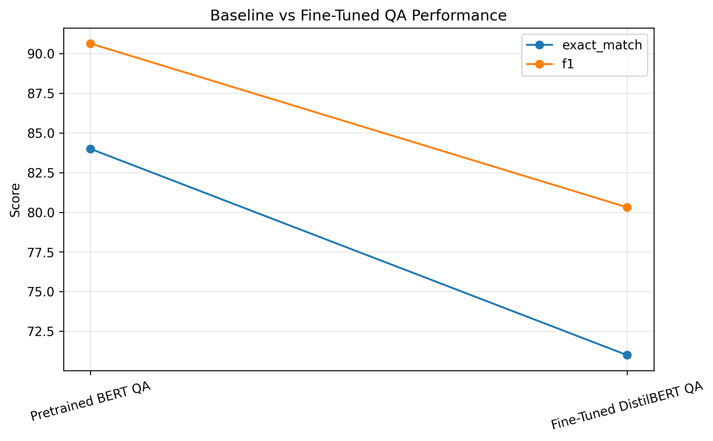

# Transformer-Based Question Answering: Fine-Tuning, Failure Modes, and Performance Trade-offs


This project builds an end-to-end transformer-based question answering (QA) system using the SQuAD dataset. It evaluates a strong pretrained baseline (BERT-large) and develops a fine-tuned DistilBERT model, highlighting trade-offs between model size, compute, and performance.

## Key Results

- **Pretrained BERT QA (baseline)**
  - Exact Match (EM): **84.0**
  - F1 Score: **90.6**

- **Fine-Tuned DistilBERT QA**
  - Exact Match (EM): **71.0**
  - F1 Score: **80.3**

- Fine-tuning improved the smaller model substantially across iterations, increasing performance from an initially weak run to a much stronger final result.

## Model Comparison



---

## Project Overview

This project implements a full deep learning NLP pipeline for extractive question answering:

- Data loading and preprocessing using HuggingFace `datasets`
- Baseline evaluation using a pretrained BERT QA model
- Fine-tuning DistilBERT on SQuAD
- Model evaluation using Exact Match (EM) and F1 metrics
- Performance comparison and visualization

---

## Key Insights

### 1. Model Size vs Performance Trade-off
- BERT-large achieves superior performance due to its scale and extensive pretraining
- DistilBERT provides competitive performance with significantly lower computational cost

### 2. Importance of Pipeline Correctness
- Initial fine-tuning produced very poor results due to preprocessing and span alignment issues
- Fixing tokenization and answer span mapping dramatically improved performance

### 3. Impact of Data Scaling
- Increasing training data (5k → 10k → 20k samples) led to consistent improvements in EM and F1 scores
- Demonstrates the importance of sufficient data when fine-tuning transformer models

### 4. Error Analysis
Common failure cases include:
- Semantic ambiguity (e.g., “theme” questions)
- Overly long predicted spans
- Confusion between similar contextual phrases (e.g., team vs conference references)

---

## Interpretability & Business Implications

### What the Model Learns

The model effectively extracts concise factual answers from unstructured text, particularly for:

- Entity-based questions (teams, locations, organizations)
- Numerical and date-related queries
- Direct fact retrieval from context

However, performance degrades for:

- Abstract or semantic questions (e.g., themes, intent-based queries)
- Contexts with multiple competing phrases
- Cases requiring deeper reasoning beyond span extraction

---

### Example Business Use Cases

This type of QA system can be applied across multiple domains:

**1. Customer Support Automation**
- Automatically answer customer questions from product documentation
- Reduce support ticket volume and response time

**2. Enterprise Knowledge Retrieval**
- Enable employees to query internal documents and reports
- Improve decision-making speed by surfacing relevant information instantly

**3. Legal and Compliance Search**
- Extract key clauses and facts from large legal documents
- Support faster review and auditing processes

**4. Financial and Research Analysis**
- Retrieve insights from reports, filings, or research papers
- Assist analysts in navigating large volumes of text

---

### Practical Considerations

- Larger pretrained models (e.g., BERT-large) provide higher accuracy but require more compute
- Smaller models (e.g., DistilBERT) offer faster and cheaper deployment with moderate performance trade-offs
- Fine-tuning quality depends heavily on data volume, preprocessing correctness, and training setup

---

### Key Takeaway

This project demonstrates how transformer-based QA systems can move from research to real-world applications, balancing performance, efficiency, and deployment constraints.

---

## Example Predictions

| Question | Predicted Answer | Exact Match |
|---------|----------------|------------|
| Which team won Super Bowl 50? | Denver Broncos | ✓ |
| Where did Super Bowl 50 take place? | Santa Clara, California | ✓ |
| What color emphasized the 50th anniversary? | gold | ✓ |

(See full results in `outputs/tables/sample_predictions.csv`)

---

## Tech Stack

- Python
- PyTorch
- HuggingFace Transformers
- HuggingFace Datasets
- Pandas
- Matplotlib

---

```markdown
## Repository Structure
qa-transformer-project/
├── notebooks/
│ └── qa_transformer_project.ipynb
├── scripts/
├── outputs/
│ ├── figures/
│ │ └── model_comparison.png
│ ├── tables/
│ │ ├── model_comparison.csv
│ │ └── sample_predictions.csv
├── data/
├── requirements.txt
└── README.md